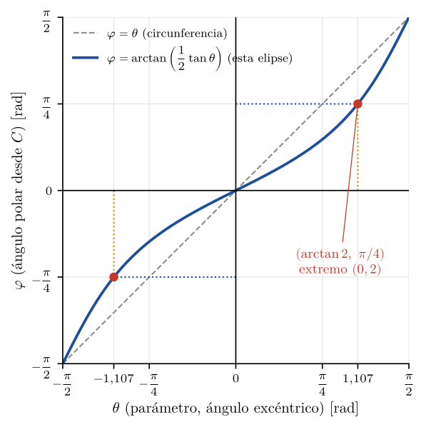

# Parametrización de un arco de elipse: por qué el rango no es $[-\pi/4,\ \pi/4]$

**Materia:** Álgebra y Geometría Analítica — Unidad 7 (Cónicas y parametrización)\
**Ejercicio:** TP N° 7, segunda parte, Ejercicio 1, inciso b)

---

## 1. Enunciado

> Halle las ecuaciones paramétricas de la siguiente curva de $\mathbb{R}^2$ e indique el rango del parámetro:
>
> $$x^2 + 2x + 4y^2 - 8y = 0, \qquad x \ge 0$$

El ejercicio tiene dos partes de distinto peso. Parametrizar la cónica completa es un procedimiento de rutina. El rango del parámetro, en cambio, generó discusión en clase: la intuición geométrica sugiere $[-\pi/4,\ \pi/4]$, pero el cálculo da $[-1{,}107;\ 1{,}107]$ rad. Este documento resuelve el ejercicio y explica de dónde sale esa diferencia.

---

## 2. Resolución

### 2.1. De la ecuación general a la ecuación ordinaria

La ecuación dada está en **forma general** (todos los términos desarrollados, igualados a cero). Como los coeficientes de $x^2$ y de $y^2$ son distintos (1 y 4) pero tienen el mismo signo, se espera una **elipse**. Para confirmarlo, se lleva a la forma ordinaria.

**Paso 1 — Factor común 4 en los términos en $y$:**

$$x^2 + 2x + 4\,(y^2 - 2y) = 0$$

**Paso 2 — Completar cuadrados.** En cada paréntesis se suma y resta el cuadrado de la mitad del coeficiente lineal:

$$\big[(x+1)^2 - 1\big] + 4\,\big[(y-1)^2 - 1\big] = 0$$

$$(x+1)^2 + 4\,(y-1)^2 = 5$$

**Paso 3 — Dividir ambos miembros por 5** para que el segundo miembro valga 1:

$$\frac{(x+1)^2}{5} + \frac{(y-1)^2}{5/4} = 1$$

El 4 que se sacó como factor común pasa al denominador del término en $y$ como $\frac{5}{4}$, porque $\frac{4}{5} = \frac{1}{5/4}$.

Esta es la **ecuación ordinaria** de una elipse con centro $C(\alpha, \beta)$:

$$\frac{(x-\alpha)^2}{a^2} + \frac{(y-\beta)^2}{b^2} = 1$$

> **Nomenclatura (según el apunte de cátedra, Unidad 7):**
>
> - **Ecuación general:** $Ax^2 + Cy^2 + Dx + Ey + F = 0$.
> - **Ecuación ordinaria:** la forma de arriba, con centro $C(\alpha,\beta)$ cualquiera.
> - **Ecuación canónica:** el caso particular con centro en el origen, $\frac{x^2}{a^2}+\frac{y^2}{b^2}=1$.
>
> A pasar de la forma general a la ordinaria se le dice informalmente "reducir" la ecuación, y algunos textos hablan de "ecuación reducida". El término de la cátedra es *forma ordinaria*.
>
> Cuando el segundo miembro vale 0 en vez de 1, la cónica es **degenerada**: para una elipse queda un único punto (el centro), y para una hipérbola, un par de rectas que se cortan (la figura "angulosa"). Si el segundo miembro es negativo, la elipse no tiene puntos reales.

### 2.2. Elementos de la elipse

| Elemento | Valor | Observación |
|---|---|---|
| Centro | $C(-1,\ 1)$ | Sale de $x+1 = x-(-1)$ e $y-1$ |
| Semieje horizontal | $a = \sqrt{5} \approx 2{,}236$ | Es el **semieje mayor** porque $5 > \frac{5}{4}$ |
| Semieje vertical | $b = \frac{\sqrt{5}}{2} \approx 1{,}118$ | Es el **semieje menor** |
| Cociente | $\frac{b}{a} = \frac{1}{2}$ | La elipse es el doble de ancha que de alta |
| Eje focal | $y = 1$ (horizontal) | El eje mayor es paralelo al eje $x$ |

### 2.3. Parametrización de la elipse completa

La ecuación ordinaria es una suma de dos cuadrados igual a 1:

$$\left(\frac{x+1}{\sqrt5}\right)^2 + \left(\frac{y-1}{\sqrt5/2}\right)^2 = 1$$

Por la identidad $\cos^2\theta + \operatorname{sen}^2\theta = 1$, se define:

$$\frac{x+1}{\sqrt5} = \cos\theta, \qquad \frac{y-1}{\sqrt5/2} = \operatorname{sen}\theta$$

Despejando $x$ e $y$:

$$\boxed{\;x = -1 + \sqrt5\,\cos\theta, \qquad y = 1 + \frac{\sqrt5}{2}\,\operatorname{sen}\theta\;}$$

Con $\theta \in [0,\ 2\pi)$ se recorre la elipse completa una vez, en sentido antihorario.

### 2.4. Restricción $x \ge 0$: rango del parámetro

Se sustituye la expresión paramétrica de $x$ en la condición:

$$x \ge 0 \iff -1 + \sqrt5\,\cos\theta \ge 0 \iff \cos\theta \ge \frac{1}{\sqrt5}$$

En el intervalo $(-\pi,\ \pi]$, el coseno es mayor o igual que $\frac{1}{\sqrt5}$ en un intervalo simétrico alrededor de $\theta = 0$:

$$-\arccos\frac{1}{\sqrt5} \;\le\; \theta \;\le\; \arccos\frac{1}{\sqrt5}$$

$$\arccos\frac{1}{\sqrt5} = \arctan 2 \approx 1{,}1071 \text{ rad} \approx 63{,}43^\circ$$

> La igualdad $\arccos\frac{1}{\sqrt5} = \arctan 2$ se ve en un triángulo rectángulo de catetos 1 y 2: la hipotenusa mide $\sqrt5$, el coseno vale $\frac{1}{\sqrt5}$ y la tangente vale $\frac{2}{1} = 2$.

**Respuesta del ejercicio:**

$$\boxed{\;\begin{cases} x = -1 + \sqrt5\,\cos\theta \\[4pt] y = 1 + \dfrac{\sqrt5}{2}\,\operatorname{sen}\theta \end{cases} \qquad \theta \in \left[-\arctan 2,\ \arctan 2\right] \approx [-1{,}107;\ 1{,}107] \text{ rad}\;}$$

### 2.5. Verificación de extremos y sentido de recorrido

| $\theta$ | $\cos\theta$ | $\operatorname{sen}\theta$ | Punto $(x,y)$ | Rol |
|---|---|---|---|---|
| $-\arctan 2$ | $\frac{1}{\sqrt5}$ | $-\frac{2}{\sqrt5}$ | $(0,\ 0)$ | Punto inicial |
| $0$ | $1$ | $0$ | $(-1+\sqrt5,\ 1) \approx (1{,}236;\ 1)$ | Vértice derecho |
| $\arctan 2$ | $\frac{1}{\sqrt5}$ | $\frac{2}{\sqrt5}$ | $(0,\ 2)$ | Punto final |

Estos extremos coinciden con los cortes con el eje $y$ que se calculan directamente: con $x = 0$ en la ecuación general queda $4y^2 - 8y = 0$, es decir $4y(y-2) = 0$, de donde $y = 0$ o $y = 2$.

El arco se recorre en **sentido antihorario**: va de $(0,0)$ a $(0,2)$ pasando por el vértice derecho (@fig:arco).

![Elipse $\frac{(x+1)^2}{5}+\frac{(y-1)^2}{5/4}=1$ y arco $x \ge 0$ (en rojo), recorrido en sentido antihorario para $\theta \in [-\arctan 2,\ \arctan 2]$.](figuras/fig1_elipse_arco.png){#fig:arco}

---

## 3. La discusión: ¿por qué no $[-\pi/4,\ \pi/4]$?

### 3.1. La observación de clase es correcta

Los puntos de corte $(0,0)$ y $(0,2)$, vistos desde el centro $C(-1,1)$, están en las direcciones:

$$\vec{CP_{\text{sup}}} = (0,2) - (-1,1) = (1,\ 1), \qquad \vec{CP_{\text{inf}}} = (0,0) - (-1,1) = (1,\ -1)$$

Ambos vectores forman exactamente $\pm 45^\circ$ con la horizontal. **La observación gráfica es correcta**: los extremos del arco están a $\pm\pi/4$ del centro.

### 3.2. El error está en la interpretación de $\theta$

El razonamiento "los puntos están a $45^\circ$, entonces $\theta$ va de $-\pi/4$ a $\pi/4$" da por sentado algo que **en una elipse no se cumple**: que el parámetro $\theta$ es el ángulo que forma el radio vector $\vec{CP}$ con la horizontal.

Conviene distinguir dos ángulos:

| Símbolo | Nombre | Definición | Valor en $(0,2)$ |
|---|---|---|---|
| $\varphi$ | **Ángulo polar** desde el centro | Ángulo real del segmento $\overline{CP}$ | $45^\circ = \pi/4$ |
| $\theta$ | **Ángulo excéntrico** (el parámetro) | Argumento de $\cos$ y $\operatorname{sen}$ en la parametrización | $63{,}43^\circ \approx 1{,}107$ rad |

Una comprobación directa: si se reemplaza $\theta = \pi/4$ en la parametrización, el punto que se obtiene es $(0{,}581;\ 1{,}791)$, que **no está sobre el eje $y$**. Tomar $[-\pi/4,\ \pi/4]$ dejaría afuera parte del arco con $x \ge 0$.

### 3.3. Qué representa geométricamente $\theta$: la circunferencia auxiliar

El parámetro $\theta$ sí es un ángulo real, pero **de otra figura**: la **circunferencia auxiliar** (o principal), con el mismo centro $C$ y radio igual al semieje mayor $a = \sqrt5$.

Para cada $\theta$:

- $Q = C + a\,(\cos\theta,\ \operatorname{sen}\theta)$ es un punto de la **circunferencia auxiliar**.
- $P = C + (a\cos\theta,\ b\operatorname{sen}\theta)$ es el punto de la **elipse**.

$P$ tiene la misma abscisa que $Q$, pero su ordenada respecto del centro se multiplica por $\frac{b}{a} = \frac12$. En otras palabras, la elipse es la circunferencia auxiliar **comprimida verticalmente a la mitad** respecto del centro. El parámetro $\theta$ es el ángulo de $Q$, no el de $P$.

En este ejercicio el efecto se ve muy claro. Para $\theta = \arctan 2$:

$$Q = (-1,1) + \sqrt5\left(\tfrac{1}{\sqrt5},\ \tfrac{2}{\sqrt5}\right) = (0,\ 3), \qquad P = (0,\ 2)$$

$Q$ y $P$ están **ambos sobre el eje $y$**. La recta $x = 0$ corta a la circunferencia auxiliar en $(0,3)$ y en $(0,-1)$, a $\pm 63{,}43^\circ$ del centro, y corta a la elipse en $(0,2)$ y $(0,0)$, a $\pm 45^\circ$. La compresión vertical lleva cada punto de corte de la circunferencia al de la elipse, pero no conserva el ángulo (@fig:aux).

{#fig:aux}

### 3.4. La fórmula que vincula ambos ángulos

Desde el centro, la pendiente del segmento $\overline{CP}$ es:

$$\tan\varphi = \frac{y-\beta}{x-\alpha} = \frac{b\operatorname{sen}\theta}{a\cos\theta} \quad\Longrightarrow\quad \boxed{\;\tan\varphi = \frac{b}{a}\,\tan\theta\;}$$

La relación vale para $\theta \in (-\pi/2,\ \pi/2)$, que contiene todo el arco del ejercicio. Con $\frac{b}{a} = \frac12$:

- **De $\varphi$ a $\theta$:** $\tan\theta = \frac{a}{b}\tan\varphi = 2\tan\frac{\pi}{4} = 2 \;\Rightarrow\; \theta = \arctan 2 \approx 1{,}107$ rad.
- **De $\theta$ a $\varphi$:** $\tan\varphi = \frac12\tan(\arctan 2) = 1 \;\Rightarrow\; \varphi = \frac{\pi}{4}$.

Las dos cifras de la discusión, $\pi/4$ y $1{,}107$, son **la misma frontera medida con dos ángulos distintos**, y esta fórmula pasa de una a la otra. La @fig:phi muestra la relación completa.

{#fig:phi}

### 3.5. ¿Es por ser elipse o por no estar centrada en el origen?

Se analizan las dos hipótesis por separado:

| Hipótesis | Prueba | Resultado |
|---|---|---|
| **El centro desplazado** | Se traslada la misma elipse al origen: $\frac{x^2}{5}+\frac{y^2}{5/4}=1$. La recta equivalente a $x=0$ pasa a ser $x = 1$. Queda $\sqrt5\cos\theta \ge 1$, otra vez $\theta \le \arctan 2$. | **Mismo rango.** La traslación no cambia nada. |
| **La forma elíptica** ($a \ne b$) | Se toma una **circunferencia** de centro $(-1,1)$ que pase por $(0,0)$ y $(0,2)$: radio $r = \sqrt2$. Queda $-1+\sqrt2\cos\theta \ge 0 \Rightarrow \cos\theta \ge \frac{1}{\sqrt2} \Rightarrow \theta \in [-\pi/4,\ \pi/4]$. | **Aparece $\pi/4$.** En la circunferencia $\theta = \varphi$. |

**Conclusión:** la diferencia se debe **exclusivamente a que la curva es una elipse** ($a \ne b$). Que el centro no esté en el origen no influye, siempre que los ángulos se midan desde el centro, como corresponde. En la circunferencia, $\frac{b}{a} = 1$ y la fórmula da $\tan\varphi = \tan\theta$: los dos ángulos coinciden y la intuición de los $45^\circ$ es exacta. La @fig:hipotesis muestra las dos pruebas.

![Izquierda: circunferencia de centro $(-1,1)$ que pasa por $(0,0)$ y $(0,2)$; el parámetro coincide con el ángulo polar ($45^\circ$). Derecha: la elipse del ejercicio trasladada al origen; el rango sigue siendo $[-\arctan 2,\ \arctan 2]$.](figuras/fig4_hipotesis.png){#fig:hipotesis}

La traslación es un movimiento rígido y conserva ángulos. La compresión en una sola dirección no los conserva: deja intactos los ángulos de $0^\circ$, $90^\circ$, $180^\circ$ y $270^\circ$ y deforma todos los intermedios.

### 3.6. ¿Es "incorrecto" el intervalo $[-\pi/4,\ \pi/4]$?

Lo incorrecto es usar $[-\pi/4,\ \pi/4]$ **con la parametrización trigonométrica estándar**. Ese rango es correcto para otra parametrización igualmente válida, la **polar desde el centro**, que usa $\varphi$ como parámetro:

$$x = -1 + r(\varphi)\cos\varphi, \qquad y = 1 + r(\varphi)\operatorname{sen}\varphi, \qquad r(\varphi) = \frac{ab}{\sqrt{b^2\cos^2\varphi + a^2\operatorname{sen}^2\varphi}}$$

con $\varphi \in [-\pi/4,\ \pi/4]$. Como control: $r(\pi/4) = \sqrt2$, que es la distancia de $C$ a $(0,2)$.

Esta versión es correcta pero bastante menos práctica. La parametrización de la cátedra, con $\cos$ y $\operatorname{sen}$ directos, es la estándar justamente porque **no** usa el ángulo polar. Lo que importa es que **el rango tiene sentido solo junto con la parametrización elegida**: no es una propiedad de la curva sola.

---

## 4. Resumen

| Concepto | Valor |
|---|---|
| Ecuación ordinaria | $\frac{(x+1)^2}{5} + \frac{(y-1)^2}{5/4} = 1$ |
| Centro y semiejes | $C(-1,1)$, $a = \sqrt5$, $b = \frac{\sqrt5}{2}$ |
| Parametrización | $x = -1+\sqrt5\cos\theta$, $\ y = 1+\frac{\sqrt5}{2}\operatorname{sen}\theta$ |
| Rango para $x \ge 0$ | $\theta \in [-\arctan 2,\ \arctan 2] \approx [-1{,}107;\ 1{,}107]$ rad $(\pm 63{,}43^\circ)$ |
| Extremos del arco | $(0,0)$ en el inicio y $(0,2)$ en el final, recorrido antihorario |
| Ángulo polar de los extremos | $\varphi = \pm\pi/4$ (desde el centro) |
| Vínculo | $\tan\varphi = \frac{b}{a}\tan\theta$ |
| Causa de la diferencia | $a \ne b$ (elipse), no la posición del centro |

## 5. Errores comunes

1. **Tomar el parámetro $\theta$ como el ángulo polar del punto.** Solo coinciden en la circunferencia o en los vértices ($\theta = 0, \frac{\pi}{2}, \pi, \frac{3\pi}{2}$).
2. **Olvidar el factor 4 al dividir por 5:** el término en $y$ queda $\frac{4(y-1)^2}{5} = \frac{(y-1)^2}{5/4}$, no $\frac{(y-1)^2}{5}$. De eso depende que $b = \frac{\sqrt5}{2}$ y no $\sqrt5$, que sería una circunferencia.
3. **Medir ángulos desde el origen** en vez de desde el centro. Desde el origen, el punto $(0,2)$ está a $90^\circ$, un valor que no tiene relación con ninguna de las dos parametrizaciones.
4. **Dar el rango sin la parametrización.** El intervalo $[-1{,}107;\ 1{,}107]$ vale para $x = -1+\sqrt5\cos\theta$. Con $x = -1+\sqrt5\operatorname{sen}\theta$ (también válida) el rango sería otro.

---

## 6. Marco teórico

### 6.1. Por qué se parametriza con "centro + semieje × coseno/seno"

La parametrización transforma la condición cartesiana (una ecuación entre $x$ e $y$) en una regla para **generar** los puntos uno por uno a partir de un único número $\theta$.

La idea es buscar dos funciones de $\theta$ que cumplan la ecuación **de manera automática**. La identidad pitagórica

$$\cos^2\theta + \operatorname{sen}^2\theta = 1$$

ya tiene la forma "suma de dos cuadrados igual a 1", la misma que la ecuación ordinaria. Por eso se identifica término a término:

$$\underbrace{\left(\frac{x-\alpha}{a}\right)^2}_{\cos^2\theta} + \underbrace{\left(\frac{y-\beta}{b}\right)^2}_{\operatorname{sen}^2\theta} = 1$$

Cada parte de la fórmula $x = \alpha + a\cos\theta$ tiene un papel:

- $\cos\theta$ recorre $[-1,1]$: es la posición "normalizada" de un punto en la circunferencia unitaria.
- **Multiplicar por $a$** estira ese intervalo hasta $[-a,\ a]$ (escala).
- **Sumar $\alpha$** lleva ese intervalo al centro de la figura (traslación).

Toda elipse es la imagen de la circunferencia unitaria por una **escala** (factores $a$ y $b$ en cada eje) seguida de una **traslación** (al centro $C$). El parámetro $\theta$ es el ángulo en la circunferencia unitaria **antes** de la escala, y por eso no coincide con el ángulo que se mide en la elipse ya deformada. Ese es el origen formal de la discusión de la sección 3.

### 6.2. Parametrizaciones no únicas

Una misma curva admite infinitas parametrizaciones. El apunte de cátedra muestra, por ejemplo, que $(R\cos t,\ R\operatorname{sen}t)$ y $(R\operatorname{sen}t,\ R\cos t)$ describen la misma circunferencia con distinto punto inicial y sentido de recorrido. Por eso el enunciado pide "las ecuaciones paramétricas **y** el rango": las dos cosas forman una sola respuesta.

### 6.3. "Desparametrización" (verificación inversa)

Para comprobar una parametrización se elimina el parámetro. De $\cos\theta = \frac{x+1}{\sqrt5}$ y $\operatorname{sen}\theta = \frac{2(y-1)}{\sqrt5}$, elevando al cuadrado y sumando:

$$\frac{(x+1)^2}{5} + \frac{4(y-1)^2}{5} = 1 \;\Longrightarrow\; (x+1)^2 + 4(y-1)^2 = 5$$

que es la ecuación ordinaria del paso 2.1.

---

*Fuentes:*\
*`TP 7 - EJERCICIOS RESUELTOS (2°parte).pdf` — Ejercicio 1 b), resolución de cátedra (parametrización y rango $-1{,}107 \le \theta \le 1{,}107$ rad).*\
*`Unidad 7 teoría.pdf` (AGA Virtual) — nomenclatura de ecuación general, ordinaria y canónica; semieje mayor y menor; parametrización de la circunferencia y de la elipse; no unicidad de la parametrización.*\
*Verificación numérica de todos los valores (cortes, extremos, $\arctan 2$, $r(\pi/4) = \sqrt2$, hipótesis de traslación y de circunferencia) realizada con Python/NumPy.*
